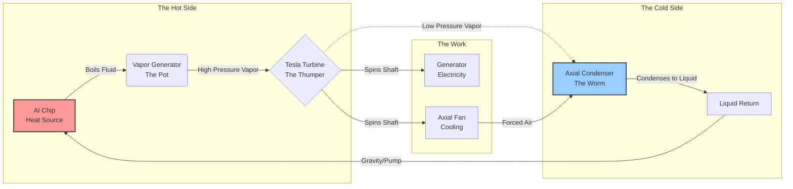

# 🌑 Project Moonshine
**High Proof Compute. Zero Waste.**

> "Data centers are thirsty. We built a still."

## 🔓 Open Source & Prior Art
**Project Moonshine is Open Hardware.**
This repository serves as a **Defensive Publication**. The designs, thermodynamic loops, and "Axial Still" layouts described herein are placed in the public sphere to prevent proprietary enclosure of this technology.
* **License:** [Apache 2.0](LICENSE)
* **Commercial Use:** ✅ Allowed
* **Liability:** ❌ None (Use at your own risk)

## 🥃 The Problem
AI is dehydrating the planet. A single conversation with a large model can consume a bottle of water in cooling evaporation. Current data centers are essentially massive swamps that evaporate millions of gallons of local freshwater into the atmosphere every year. They are thermodynamically lazy and ecologically expensive.

## 🌽 The Solution: The "AI Still"
**Project Moonshine** is an open-source hardware specification for a **self-cooling, energy-recovering compute node**.

Instead of using water to cool chips and throwing the heat away, we use the heat to boil a working fluid (60/40 Ethanol/Water), spin a turbine, and cool itself down. It’s a closed-loop "still" that sits in a server rack.

### The "Mash Bill" (Specs)
* **Fluid:** 60/40 Ethanol/Water Azeotrope (The "Wash").
* **Boiling Point:** ~80°C (Perfect for GPU operating temps).
* **Architecture:** In-Line Axial "Jet Engine" Layout.
* **Net Impact:** **Zero Water Loss** + **15% Energy Recovery** (by eliminating parasitic cooling loads).

## 📐 Design Tracks (Form Factors)
### Track A: "The Rickhouse" (2U Rack Mount)
* **Target:** High-density Data Centers.
* **Constraint:** Height < 88mm.
* **Condenser:** Horizontal Axial.

### Track B: "The Tower" (Vertical Desktop)
* **Target:** Home Lab / DIY.
* **Constraint:** 140mm footprint.
* **Advantage:** Gravity Feed (No Pump).

## 🔧 How It Works (The Loop)

### 1. The Cycle (Mermaid Diagram)


### 2. The Geometry (ASCII Schematic)
```text
THE MOONSHINE "AXIAL TUNNEL" NODE
(Side View Cross-Section)

      [ HOT ZONE ]                      [ COLD ZONE ]
      
      +---------+      (Drive Shaft)     +---------------------------+
      | TURBINE |========================| FAN (Mounted on Shaft)    |
      +---------+           ||           +---------------------------+
           ^                ||                        ^
           | (Vapor In)     || (The "Spine")          | (Air Exhaust)
      +====|================||========================|==============+
      |    |            +--------+              +-----------+        |
      |  [BOILER]       | GEARS  |              | CONDENSER |        |
      | (AI Chip)       | & GEN  |              | (Fin Tube)|        |
      |                 +--------+              |           |        |
      |                                         |  <-- Air  |        |
      |    (Liquid Return Line)                 |  <-- In   |        |
      +==============================================================+
      
      1. AI heats Boiler.
      2. Vapor spins Turbine.
      3. Turbine spins Shaft.
      4. Shaft spins Fan.
      5. Fan cools Condenser.
      6. Loop repeats.
```

### 3. Mechanical Assembly (Detailed Component Map)
```text
      THE AXIAL TUNNEL: MECHANICAL DETAIL
      (Radial Cross-Section)

           ___________________________________________
          /      [EXTERNAL CHASSIS (ALUMINUM)]        \
         |    _____________________________________    |
         |   /                                     \   |
         |  |   [G10 SPIDER MOUNT]                  |  | <--- Thermal Isolation
         |  |          |                            |  |
         |  |   _______V_________________________   |  |
         |  |  /      [CONDENSER TUBE]           \  |  | <--- The "Worm"
         |  | |   |||||||||||||||||||||||||||||   | |  |
         |  | |   |||| [INT. COPPER FINS] |||||   | |  | <--- Heat Exchange
         |  | |   |||||||||||||||||||||||||||||   | |  |
         |  | |                                   | |  |
         |  | |     ==== [CENTRAL SHAFT] ====     | |  | <--- The Spine
         |  | |                                   | |  |
         |  | |   |||||||||||||||||||||||||||||   | |  |
         |  | |   |||||||||||||||||||||||||||||   | |  |
         |  |  \_________________________________/  |  |
         |  |          |                            |  |
         |  |   [G10 SPIDER MOUNT]                  |  |
         |   \_____________________________________/   |
         |_____________________________________________|

      [KEY COMPONENTS]
      * SPIDER MOUNTS: Zirconia or G10 Garolite. Suspends the 80°C tube 
        inside the 25°C chassis to prevent heat soaking.
      * THE SPINE: 8mm Stainless Steel shaft. Transfers 15,000 RPM 
        from the Turbine to the Fan.
      * THE WORM: Cylindrical condenser. Air is pulled through the 
        center, directly over the fins.
```

1.  **The Mash Tun (The Chip):** The AI GPU heats up.
2.  **The Boil:** The 60/40 Wash hits the chip's cold plate and flashes into high-pressure vapor.
3.  **The Thumper (The Turbine):** The vapor rushes through a Tesla Micro-Turbine on a central shaft.
4.  **The Harvest:** The spinning shaft drives a generator (recovering 2-5% electricity) and a **Mechanical Fan**.
5.  **The Worm (The Condenser):** The fan pulls air through an axial tube of copper fins. The vapor cools, condenses back to liquid, and feeds back to the chip.

**It runs on its own heat. The harder the AI works, the faster the cooling fan spins.**

## 🚜 The Philosophy
We borrow our engineering from the bootleggers:
* **Keep the Loop Closed:** If you can smell the corn, you're leaking power.
* **Use What You Have:** Waste heat is just energy you haven't caught yet.
* **Fix it with a Wrench:** No proprietary "black box" cooling. Everything is printable, castable, or off-the-shelf.

## 🤝 Contributing
We need Coopers (CAD), Distillers (Thermodynamics), and Runners (Software).